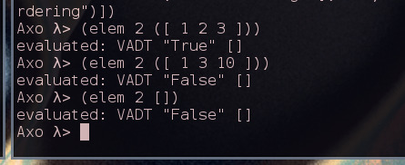
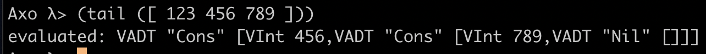

# Axolotl

> Hubo un tiempo en que yo pensaba mucho en los axolotl. Iba a verlos al acuario del Jardín des Plantes y me quedaba horas mirándolos, observando su inmovilidad, sus oscuros movimientos. Ahora soy un axolotl. _Julio Cortázar_

## Project Description

### Vision / Purpose

Axo is how we imagine Haskell as a Lisp. While Haskell has a "clean syntax" it is full syntactic sugar that makes it harder to reason/learn about, also, this makes source-code transformations not accesible to most programmers. Haskell is already good at meta-programming, with type classes, template haskell, etc. But it lacks some of the power that macros can offer. Therefore, we propose a new programming language with Haskell semantics, but with Lisp syntax, plus some syntax features that we think are convenient for programming haskell style.

### Main objective, Category

A haskell-like Lisp. Strongly typed purely functional programming language.

### Language requirements and Use Cases

The main use case is a programming language with Lisp like syntax but with Haskell semantics, which is also strongly typed. Additionally, use cases where you can leverage the use of algebraic data types.\

- The language will have the following primitives:
    - Int
    - Float
    - Char
- The language will be strongly typed
- Values will be immutable
- The language can evaluate arithmetic expressions
- Everything inside a program will be an expression
- The language will allow read and write from console
- The language will allow user defined algebraic data types
- The language will have a prelude with useful functions like:
    - and, or, not
    - foldr, foldl
    - map
    - zip, zipWith
    - sum
    - length
    - take
    - reverse
    - head, tail
    - compose
    - fst, snd
    - elem
- The language will have a prelude with useful data like:
    - True, False
    - Tuple
    - List
    - Either
    - Maybe

### Test Case Description

There are three types of tests:
    - Property testing with QuickCheck that generates random values and to test for specific characteristics. For example, that Parsing and PrettyPrinting are inverse.
    - Specification testing which contains hand made tests to visualize the input and output of functions.
    - Files that demonstrate a property of the language. For example, for ADTs, there is ADT.axo

### Development Process

#### Process Description

The development process consisted of having a list of features that we wanted the language to contain. These features were ordered by a priority and by dependency. The priority consisted firstly, of the minimum elements that the project needed to contain and then by the personally asigned level of importance.\

For each feature we designed a possible implementation, once discussed, the feature was developed and finally tested. If all tests passed, it was then marked as done.\

Each feature was in one of three groups: TODO, In Progress or Done.\

#### Advancement Blogs

- 28/02/2019 : Generated Syntax Diagrams
- 03/03/2019 : Began Parser
- 12/03/2019 : First Parser Version Done
- 18/03/2019 : Began toAST transformation
- 20/03/2019 : Added Pretty Printing for Expressions
- 29/03/2019 : Began Evaluation Process
- 05/04/2019 : Began Interpreter
- 18/04/2019 : Adds :load command to Interpreter
- 22/04/2019 : Finished Type Checking
- 28/04/2019 : Pattern Matching Algorithm Implementation
- 03/05/2019 : Added toGraph for the AST
- 05/05/2019 : Final Features Implementation

#### Lessons Learned by Eduardo

Realizando este proyecto aprendi muchas cosas. Entre las cosas que aprendí que los compiladores son programas inherentemente grandes y complejos, pero a la vez interesantes y emocionantes, así como también que es mejor hacerlos de manera modular. Me quedo con haber aprendido mucho de representaciónes intermedias, estrategias de evaluación, parsing, gramáticas y léxico, semántica, pattern matching, Algebraic Data Types.
\
\
\
\

\_\_\_\_\_\_\_\_\_\_\_\_\_\_\_\_\_\_\_\_\_\_\_\_\_\_\_\_\_\_\_\_\_\_\_


#### Lessons Learned by Lazaro

This project really taught me the inner workings of functional programs. Before this, even though I had used several functional programs, I did not truly comprehend why they behaved in several ways or even why they had such behavior. In the process of creating Axo I came across readings such as Okasaki's _"Purely Functional Data Structures"_, which opened my eyes to the world of not having any side effects, being strongly typed and lazy evaluation.\ 
More related to the generation of the compiler, I really enjoyed learning how to represent programs and how programs can be thought of as graphs and the execution of a program as a traversal of said graph.\
Additionally, I learned about monadic parser combinators when using Megaparser. I did not know that by using tools such as this one, you could bypass the intermediate code generation (for example with using flex and bison) and go directly to an AST.
\
\
\
\
\_\_\_\_\_\_\_\_\_\_\_\_\_\_\_\_\_\_\_\_\_\_\_\_\_\_\_\_\_\_\_\_\_\_\_

## Language Description

### Language Name

Axolotl, or Axo, for short.

### General Language Characteristics

- Axo is a purely functional language. It is strongly typed and values are immutable. It combines Haskell-like semantics with Lisp-like syntax.
- Function declaration in as follows: `(define <function name> [<type definition>] {(<pattern> -> <body>)}+)`.
- A program is a series of expressions.
- An expression must be enclosed by parenthesis.
- Expressions can be combined with other expressions by means of function application or special forms.
- There is some syntactic sugar, like example in Infix Expressions. For example, writing: `{x + y}` instead of `(+ x y)`.
- All operators are functions.
- There can be user defined types. These are declared as follows: `(data <Type Name> {<Type Var>} -> {<constructor declaration>}+)`.
- There are lambda expressions. These are declared as follows: `(\ <pattern> [<type definition>] -> <body>)`.
- There are two modes: Interactive mode and from file. Both of them should generate the same output once excecuted. There should be no difference between loading everything from file and writing each expression one by one in the repl. With the exception that in files you are allowed to use a variable or function that is declared later on in the file, as long as they share the same scope. 

### Possible Errors

#### Compilation Errors

##### Syntactic Errors

- Parsing Errors
- Error converting to AST
- Empty Program

##### Semantic Errors

 - Mismatched types
 - Not a Function
 - Unbound Variable

#### Execution Errors

Execution errors should not occur in programs that are well typed, exept if a function that can break the program is used.

- Failed to match pattern
- Incomplete patterns
- Var not found
- Object not applicable

## Compiler Description

### Language and OS used for development

Axo is written in Haskell, and developed on MacOS and Debian linux.\

For parsing we used Megaparsec, which is a monadic parser combinator library.\

### Lexical Analysis

#### Construction Patterns

All the language is case sensitive

Tokens:

| name           | Description                                                        | Regex     | Examples                               |
|----------------|--------------------------------------------------------------------|-----------|----------------------------------------|
| Integer        | one or more digits                                                 | [-][0-9]+       | `1`, `234`, `3556` |
| Float          | one or more digits, a decimal point followed by one or more digits | [-][0-9]+.[0-9] | `1.23`, `0.5`, `2234` |
| string literal | any char or escaped char between double quotes                     | "[.]*"         | `"a string"`, `""` |
| char literal   | only one char or eschaped char between single quotes               | '.'          | `'a'`,`'\n'`  |
| varId          | any sequence of non reserved chars, starting with a lowercase char | [a-z][^(reseverdChars)]      | `a`, `solve`, `x0`,`>>=` |
| typeId         | any sequence of non reserved chars, starting with a uppercase char | [A-Z][^(reseverdChars)]     | `List`, `Maybe`, `Int` |

Lexems:

- Digit\


- Letter\


- Decimal\


- Int\


- Float\


- UniChar\


- LowerUni\


- UpperUni\


- Char\


- String\


- Identifier\


- VarId\


- TypeId\


- ReservedChars\


- ValidSymbol\


- NotDoubleQuote\


### Syntactical Analysis

Grammar:

- Program\


- SExp\


- ExpSeq\


- Exp\


- Atom\


- Literal\


- InfixExp\


- Comment\


## Intermediate Code Generator & Semantical Analysis

### Semantic Characteristics 

Our language is divided into two fields: values and types. Values are data whereas types are sets of values.

Values and expressions

-   The language has semantics close to Haskell.
-   It has a strong static type system, therefore every expression has a type.
-   All variables are immutable.

The field of values include primitives and user defined. Primitives like a number, a character or a function, and user defined like a tree. These are all first class.\ Expressions are a combination of values by the means of function application. For example `(+ 2 3)` or the function `( x -> (* x x))`. There is a very special value: undefined. When undefined is evaluated, the program crashes. Undefined allows us to define [partial functions](<https://en.wikipedia.org/wiki/Partial_function>).\ Similarly there is a very special function: error. This function receives a String s and returns undefined, which will crash the program with the error message s.

It is important to note that Axo does not differentiate between functions and operators, because the simplicity of the syntax allows an identifier to be composed of only symbols.

### Intermediate Representations

In the process of compilation, Axo code passes through several diferent representations, all which add or remove necessary elements in order to properly execute. 

- Intermediate Representation Process\


As shown in the diagram above, the first step is to Parse the code and generate the Parse Tree.
For this process we use Megaparsec, which is a recursive descent parser.

#### Parse Tree

The Parse Tree is the direct representation of the code. It is the same representation as if one were to draw the tree by hand.\
In this representation, there are still comments.

For example, parsing the following recursive fibonacci program:

```
(define fibr
    (0 -> 0)\
    (1 -> 1)\
    (n -> {(fibr {n - 1}) + (fibr {n - 2})}))
```

Would result in this Parse Tree

`Program [ESexp (Sexp (ExpSeq [EAtom (Id (VarId "define")),EAtom (Id (VarId "fibr")),ESexp (Sexp (ExpSeq [EAtom (Literal (IntLit "0")),EAtom (Id (VarId "->")),EAtom (Literal (IntLit "0"))])),ESexp (Sexp (ExpSeq [EAtom (Literal (IntLit "1")),EAtom (Id (VarId "->")),EAtom (Literal (IntLit "1"))])),ESexp (Sexp (ExpSeq [EAtom (Id (VarId "n")),EAtom (Id (VarId "->")),EInfixexp (InfixExp (ESexp (Sexp (ExpSeq [EAtom (Id (VarId "fibr")),EInfixexp (InfixExp (EAtom (Id (VarId "n"))) (EAtom (Id (VarId "-"))) (EAtom (Literal (IntLit "1"))))]))) (EAtom (Id (VarId "+"))) (ESexp (Sexp (ExpSeq [EAtom (Id (VarId "fibr")),EInfixexp (InfixExp (EAtom (Id (VarId "n"))) (EAtom (Id (VarId "-"))) (EAtom (Literal (IntLit "2"))))]))))]))]))]`

This can also be visualized as the following tree:


Now that we understand how large the representation of a simple program gets, let us continue the intermediate representation process with a much simpler program: `{2 + 3}`.


Once we generate the Parse Tree, the following step is to apply a transformation to it in order to generate the clean expressions.

#### Clean Expressions

This is the step where all the syntactic sugar, comments and every type of expression is converted into an SExpression.\
An example of the conversion of expressions would be the Infix Expressions. In Axo code these look as follows: `{2 + 3}`. This would be changed into an SExpression that looks like: `(+ 2 3)`.

The Parse Tree representation of the original axo code is as follows:
`Program [EInfixexp (InfixExp (EAtom (Literal (IntLit "2"))) (EAtom (Id (VarId "+"))) (EAtom (Literal (IntLit "3"))))]`

The Clean Expression representation of the original axo code is as follows: 
`CleanProgram [CleanSexp [CleanVar "+",CleanLit (IntLit "2"),CleanLit (IntLit "3")]]`

One can clearly appreciate the difference when looking at the generated trees.


The Clean Expression is much more reduced and optimized for converting into an Abstract Syntax Tree.

This is a crucial step in the compilation process because it turns the code into a very condensed and straight forward representation.

These Clean Expressions need to be parsed in order to generate the final representation, an Abstract Syntax Tree.
Once again, for this process we use Megaparsec, which is a recursive descent parser.

#### Abstract Syntax Tree

The Abstract Syntax Tree is the final representation in the compilation process.

For simplity, let us see what the very simple program of `(+ 2 3)` looks like in its final AST representation.

`Program [Prim "+" [Lit (LitInt 2),Lit (LitInt 3)]]`

We can now clearly see that every part of the expression has been reduced into a primitive node.


In this final representation, every expression is reduced into an individual node.
These nodes can be any of the following:

| Type           | Description          | Example   |
|----------------|----------------------|-----------|
| Var            | a symbol             | abc       |
| Type           | a capitalized symbol | List      |
| Lit            | a literal            | 2         |
| App            | apply function or special form  | (f a b c) |
| Lam            | a lambda expression  | (\x -> {x + 2})  |
| If             | an if expression      | (if {x > 0} "x is positive" "x is negative")     |
| Def            | a define with pattern matching    | (define f x -> {x + x})   |
| Prim           | a primitive function application | (*. 1.2 3.1)     |
| Data           | an algebraic data type definition | (data Bool (True) (False))    |
| Defun          | same as define, nut without pattern matching | [A-Z][^(reseverdChars)]     |
| Case           | a case expression | no syntax     |
| Let            | a variable assign | (let (a b) c) OR (let a b)    |


### Semantic Checking

The semantic checking of Axo, boils down to traversing the generated AST while verifying a predefined set of rules.

For each literal, it checks that they have their specific type and return it. For example `2` is an IntLit, has type int and returns int.

For each function it verifies that the arguments match both in type and in the amount. It also checks that the function being applied is actually a function.

In this process, a check is done to verify that the type of each variable matches the type associated to it in the environment.

For things such as labmda expressions, it checks the types of the arguments, ideally it can infer depending on how they are used in the body. Lambda expressions return the body of themselves, this is also validated.

The checking is almost identical when applied in the repl as it is in a file.

The only difference is that in a file you can use functions that you have not yet defined in that part of the program, as long as they share the same scope.
The way this is implemented is that before doing the individual check of each function, the checker extracts the function and data definitions and adds them to the envirtonment.

In order to check the output of the program, it verifies that said output is the environment with all the top level definitions.
This is represented as a map of functions to types or error.

### Pattern Matching Compiler

In this step, the process changes from functions with equations to functions with just one body and case expressions.

The algorithm used for this process can be found in the book _"The Implementation of Functional Programming Languages"_ by Simon L. Peyton Jones and Phillip Wadler in chapters 4, 5 and 6.

## Interpreter

The interpreter is a crucial part in the success of Axolotl as a programming language.

We can separate the interpretation process in two components: the repl and the evaluation process.

### Repl

In very broad terms, the purpose of the repl is to save the current state of execution.

The repl has two main purposes:

    - To call the compiler with the user input in order to obtain the respective AST.
    - To persist the state of the compiler (the environments), between inputs.

The life cycle of the repl is as follows:


### Evaluator

The main functionality of the evaluator is that it receives the AST and the environment and it returns the value that the AST represents in said environment, together with the modified environment.

The evaluator uses a state monad that can only create local environments.

Let us call the evaluator eval, for simplicity and to match the name in the source code.

There is an eval defined for each type of AST node. Some of these definitions are recursive.

Some the the main definitions are the following:

#### Literal

A literal is evaluated to the value it represents.

#### Variable

A variable is evaluated to the associated value in the current environment.

#### Define

Define generates a new clore that encloses the environment and is evaluated to an environment extended with its own name.

#### Case

There are two possibilities in the evaluation of case.

1. A case with constructors
    - In this case it evaluates the discriminant (the expression of the case) and compares the discriminant's contructor with the constructor of each of the cases. When it finds the first match, it evaluates the body.

2. A case with literals
    - Cases with literals  have a last case called `always`, which is a default expression.\
    This can result in two outcomes:
        - Firstly, if there are only literals, default can throw an error.
        - Otherwise, if there are literals and a variable, the default is the variable itself.
            - For example, in the following code:
                ```
                0 -> 0
                1 -> 1
                n -> fib{n - 1} + fib{n - 2}
                ```
#### If 

If is a special case because it is evaulated uniquely.

As seen before in this documentation, the structure of if is: `(if predicate if-true if-false)`.
Here, we can clearly see how if the condition is true, the expression in true is evaluated. Whereas if the condition is false, the expression in false is evaluated.

It is important to note that if always evaluates an expression.

#### Function Application

Function application evaluates the object to apply.

Two different things can be evaluated, depending on the type of function.

1. If it is a closure, it evaluates each argument passed and it binds them with the arguments of the closure. 
    It extends locally the bindings and they are evaluated. This restores the passed environment and the value.

2. If it is a constructor, it returns the Algebraic Data Type.

### Primitive

Primitives are evaluated in the same way as function application.

## Proof of a Working Language

### Code

#### Factorial

##### Recursive

```
(define factr
    (0 -> 1)
    (a -> (* a (factr {a - 1}))))
```

##### Iterative

```
(define facti n -> (factiter n 1 1))

(define factiter
    (n product counter -> (if {counter > n}
                            product
                            (factiter n {counter * product}
                          {counter + 1}))))
```

#### Fibonacci

##### Recursive

```
(define fibr
    (0 -> 0)
    (1 -> 1)
    (n -> {(fibr {n - 1}) + (fibr {n - 2})})
    )
```


##### Iterative

```
(define fibi n -> (fibiter 1 0 n))

(define fibiter
    (a b count -> (if {count == 0}
                      b
                      (fibiter {a + b}
 		                       a
 			                   {count - 1}))))
```

#### Elem

```
(define elem
    (a [] -> False)
    (a {x Cons xs} ->
     (if {a == x}
        True
        (elem a xs))))
```

#### Quicksort

```
(define sort
        ([] -> [])
        ({x : xs} -> {(sort (filter (\y -> {x < y}) xs))
                       ++ {([ x ])
                       ++ (sort (filter (\y -> {x >= y} xs)))}}))
```

#### Length

```
(define length
    ([] -> 0)
    ({x Cons xs} -> (+ 1 (length xs))))
```

#### Sum

```
(define sum
    ([] -> 0)
    ({x Cons xs} -> (+ x (sum xs))))
```

#### Head

```
(define head
    ([] -> [])
    ({x Cons _} -> x))
```

#### Tail

```
(define tail
    ([] -> error "Cannot call tail on empty list")
    ({x Cons xs} -> xs))
```

#### Foldr

```
(define foldr
    (f n [] -> n)
    (f n {x : xs} -> (f x (foldr f n xs))))
```

### Results

#### Factorial


##### Recursive


##### Iterative

#### Fibonacci

##### Recursive


##### Iterative


#### Elem (Search)



#### Quicksort

#### Length


#### Sum


#### Head


#### Tail



#### Foldr


# User Manual

## Quick Reference Manual

When in repl, type `:help`.

# Appendix

## Special Functions and Forms

1.  Input/Output

    1.  IO primitives

        | Name            | Description                               |
        |-----------------|-------------------------------------------|
        | `putChar`     | writes a char                             |
        | `getChar`     | reads one char                            |

2.  Math Functions

    1.  Integers

        | Name    | Description          |
        |---------|----------------------|
        | `+`   | integer sum          |
        | `-`   | integer substraction |
        | `*`  | integer product      |
        | `/`   | integer division     |

    2.  Floats

        | Name     | Description          |
        |----------|----------------------|
        | `+.`   | float sum            |
        | `-.`   | float substraction   |
        | `*.`  | float product        |
        | `/.`   | float division       |


3.  Special Forms

    | Name | Description | Grammar |
    |------|-------------|---------|
    | `if` | evals predicate, and evals only one of the expressions depending on the result | (if &lt;predicate&gt; &lt;if-true&gt; &lt;if-false&gt;)                                  |
    | `cond`   | evaluates the clauses one by one, in the first clause that succeeds,           | (cond (&lt;clause<sub>1</sub>&gt; ... &lt;clause<sub>n</sub>&gt;))                       |
    |            | the corresponding expression is evaluated and returned.                        | where clause<sub>x</sub> = (&lt;predicate<sub>x</sub>&gt; &lt;expression<sub>x</sub>&gt; |
    | `data`   | a data type definition                                                         | (data &lt;typeName&gt; &lt;type expression&gt;)                                          |
    | `type`   | type alias                                                                     | (type &lt;typeName&gt; &lt;type expression&gt;)                                          |
    | `and`    | short-circuit `and` (also known as conditional and)                          | (and &lt;expression<sub>1</sub>&gt; &lt;expression<sub>2</sub>&gt;)                      |
    | `or`     | short-circuit `or` (also known as conditional or)                            | (or &lt;expression<sub>1</sub>&gt; &lt;expression<sub>2</sub>&gt;)                       |
    | `lambda` | a lambda abstraction (can also be written with the unicode `λ`               | (lambda (&lt;arguments&gt;) &lt;body&gt;)                                                |
    | `let`    | local bindings                                                                 | (let &lt;var name&gt; &lt;expression&gt;)                                                |
    | `define` | top level definition of a function or variable                                 | (define &lt;var name&gt; &lt;expression&gt;) or                                          |
    |            |                                                                                | (define (&lt;function name&gt; &lt;args&gt;) &lt;expression&gt;)                         |


#### Data Types

1.  Type System

    The field of types include type values and type variables. Type values are monomorphic where as type variables are polymorphic. Neither of these are first class. A type value, or just called “type”, can be understood as a set of possible values. Type variables can be understood as a set of any type. We can view type variables as generics in other languages. Type values include Int or Int -&gt; Int. Polymorphic types include the function head which type is List a -&gt; a. Therefore this functions is defined forAll a types.

    The primitive types are: Integer, Float, Character.

2.  On Types

    A sum type is the union different constructors for the same type. 
    

    On the contrary, product types can be understood as a tuple of any two types (their cartesian product), the types can be different. 
    

    Product Types are like having some "type arguments" to a data constructor, while sum types are different constructors.


## Bibliography

https://www.haskell.org
https://www.haskell.org/tutorial/goodies.html
https://docs.racket-lang.org/hackett/index.html
http://tunes.org/overview.html
https://en.wikibooks.org/wiki/Write_Yourself_a_Scheme_in_48_Hours/Towards_a_Standard_Library
http://dev.stephendiehl.com/fun/006_hindley_milner.html#types